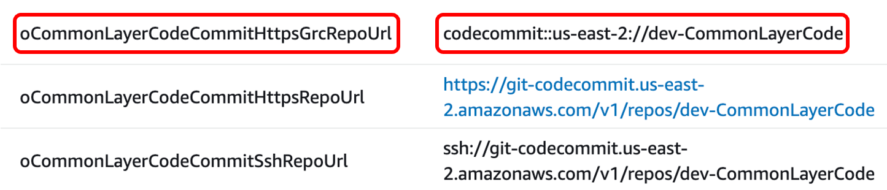

# Using AWS CodePipeline for deploying container images to microservices architecture involving AWS Lambda Functions

### **Introduction:** 


The solution in this repository is about using AWS CodePipeline to deploy docker images for microservices architecture involving AWS Lambda Functions. Packaging AWS Lambda functions as container images enables you to use familiar tooling and take advantage of larger deployment limits. Below are some of the advantages of using container images for AWS Lambda:

* Offers easier dependency management and application building with container images
    * Install native operating system packages
    * Install language-compatible dependencies
* Use a consistent set of tools for containers and Lambda-based applications
    * Use the same container registry to store application artifacts (Amazon ECR, Docker Hub) 
    * Can utilize the same build and pipeline tools to deploy
    * Tools that can inspect Dockerfiles will work the same
* Deploy large applications with AWS provided or third-party images of up to 10 GB
    * Include larger application dependencies that previously weren’t possible

By taking advantages of using container images with AWS Lambda, we can make use of AWS CodePipeline to automatically detect code changes in the source repository like AWS CodeCommit and Amazon ECR, and then pass the artifact to the build server like AWS CodeBuild to build and push the container images to Amazon ECR, which is then deployed to AWS Lambda Functions. 

### **Architecture diagram:**


In the above architecture diagram, two architectures are shown combined, namely 1. DevOps Architecture and 2. Microservices Application Architecture. DevOps architecture shows about using AWS Developer services such as AWS CodeCommit, AWS CodePipeline, AWS CodeBuild along Amazon Elastic Container Repository (ECR), and AWS CloudFormation to name a few to support Continuous Integration and Continuous Deployment/Delivery (CI/CD) for both infrastructure and application code. Microservices Application architecture shows about using various AWS Lambda Functions that are part of microservices using container images for application code. The main focus of this article is to talk about performing CI/CD for Lambda functions using container containers. The application code used in this code is a simpler version taken from [Serverless DataLake Framework](https://github.com/awslabs/aws-serverless-data-lake-framework) (SDLF). For more information, you may refer the AWS Samples GitHub repository for SDLF [here](https://github.com/awslabs/aws-serverless-data-lake-framework). 

### 
**DevOps workflow:** 


There are two CodePipelines, one for building and pushing the common layer docker image to Amazon ECR and other one for building and pushing the docker images for all the Lambda Functions within the microservices architecture to Amazon ECR, and finally deploying the microservices architecture involving AWS Lambda Functions via AWS CloudFormation. Common layer container image is used as a common layer in all other Lambda Function container images, and hence the code for it is maintained in a separate AWS CodeCommit repository, used as a source stage for an AWS CodePipeline pipeline. Common layer CodePipeline is responsible for taking the code from the CodeCommit repository and pass the artifact to an AWS CodeBuild project that builds the container image and pushes it to an Amazon ECR repository. This common layer ECR repository is used as a source in addition to the AWS CodeCommit repository that holds the code for all other Lambda Functions and other resources involved in a microservices architecture for microservices architecture CodePipeline. 

Due to the fact that all or majority of the Lambda Functions in the microservices architecture requires the common layer container image as a layer, any change made to that should invoke the microservices architecture CodePipeline that builds the container images for all Lambda Functions. Also, an AWS CodeCommit repository that holds the code for all the resources in the microservices architecture is another source to  that CodePipeline to get invoked. This has two sources because the container images in the microservices architecture should be built for changes in the common layer container image and also for the code changes made and pushed to the CodeCommit repository. 

Sample dockerfile that uses the common layer container image as a layer is shown below: 

```
ARG ECR_COMMON_DATALAKE_REPO_URL
FROM ${ECR_COMMON_DATALAKE_REPO_URL}:latest AS layer
FROM public.ecr.aws/lambda/python:3.8
# Layer Code
WORKDIR /opt
COPY --from=layer /opt/ .
# Function Code
WORKDIR /var/task
COPY src/lambda_function.py .
CMD ["lambda_function.lambda_handler"]
```

where the argument **ECR_COMMON_DATALAKE_REPO_URL** should resolve to the ECR url for common layer container image, which is provided to the `--build-args` along with [docker build](https://docs.docker.com/engine/reference/commandline/build/) command. For example: 

```
export ECR_COMMON_DATALAKE_REPO_URL="0123456789.dkr.ecr.us-east-2.amazonaws.com/dev-routing-lambda"
docker build --build-arg ECR_COMMON_DATALAKE_REPO_URL=$ECR_COMMON_DATALAKE_REPO_URL .
```

### **Deploying a Sample:** 

* **Step1**: Clone the repository [Codepipeline-lambda-docker-images](https://code.amazon.com/packages/Codepipeline-lambda-docker-images/trees/mainline) ([repo-url](ssh://git.amazon.com/pkg/Codepipeline-lambda-docker-images)) to your workstation. If using the zip file, unzip file to a local directory. 
* **Step 2:** Change directory to the cloned directory or extracted directory and the local code repository structure should look like below: 

```
|__ApplicationCode/
|  |______________cfn/
|  |______________dockerfiles/
|  |______________build.sh
|  |______________buildspec.yaml
|
|__CodePipelineTemplate/
|  |___________________codepipeline.yaml
|  |___________________parameters.json
|
|__CommonLayerCode/
|  |______________datalake-library/
|  |              |_______________python/
|  |                              |_____datalake_library/
|  |                              |_______init__.py
|  |______________buildspec.yaml
|  |______________DockerFile
|
|__utils/
|  |____DynamoDbConfig/
|       |_____________datasets-dev-table.json
|       |_____________pipelines-dev-poststage.json
|       |_____________pipelines-dev-prestage.json
|
|__metrorites-test-json-files/
|
|__readme.md
```

* **Step 3:** Deploy the CloudFormation stack using in the template file `CodePipelineTemplate/codepipeline.yaml` in any AWS region of your choice in your AWS account. This deploys the resources required for DevOps architecture involving AWS CodePipelines for common layer code and microservices architecture code. There are multiple ways to deploy a CloudFormation stack, but the most commonly used options are via AWS CloudFormation console or AWS CLI, with the stack name for example, datalake-infra-resources.
    * For deploying via AWS Console, follow the steps in the documentation **** [**Using the AWS CloudFormation console**](https://docs.aws.amazon.com/AWSCloudFormation/latest/UserGuide/cfn-using-console.html).
    * For deploying via AWS CLI, follow the steps in the documentation [**Using the AWS Command Line Interface**](https://docs.aws.amazon.com/AWSCloudFormation/latest/UserGuide/cfn-using-cli.html).
* **Step 4:** When the CloudFormation Stack deployment is complete, navigate to the AWS CloudFormation console and to the Outputs section deployed stack and take a note of the CodeCommit repository urls. There are three CodeCommit repo urls available in the CloudFormation stack outputs section for each CodeCommit repository, and you may choose one of them based on the way you would want to access it. You may refer the following documentation [Setting up for AWS CodeCommit](https://docs.aws.amazon.com/codecommit/latest/userguide/setting-up.html). I will be using [git-remote-codecommit (grc)](https://docs.aws.amazon.com/codecommit/latest/userguide/setting-up-git-remote-codecommit.html) method throughout this post for CodeCommit access. 
* **Step 5:** Clone the CodeCommit repositories:
    * **Common Layer CodeCommit repository:** Taking the value for the Output for the key **oCommonLayerCodeCommitHttpsGrcRepoUrl**


* Clone the repository:
```
git clone codecommit::us-east-2://dev-CommonLayerCode
```
* Change directory to dev-CommonLayerCode 
```
cd dev-CommonLayerCode
```
 * Add contents to the cloned repository from the source code downloaded in **Step 1.** Copy the code from the **CommonLayerCode** directory and the repo contents should look like below: ****
```
  |__datalake-library/
    |                |_______________python/
    |                                |_____datalake_library/                                  
    |                                |_______init__.py
    |__buildspec.yaml
    |__DockerFile
    |__Readme.md
```
Create the main branch and push to the remote repository
```
git checkout -b main
git add ./
git commit -m "Initial Commit"
git push -u origin main
```
* **Application CodeCommit repository:** Taking the value for the Output for the key **oAppCodeCommitHttpsGrcRepoUrl**


* Clone the repository:
```
git clone codecommit::us-east-2://dev-AppCode
```
* Change directory to dev-CommonLayerCode
```
cd dev-AppCode
```
* Add contents to the cloned repository from the source code downloaded in **Step 1.** Copy the code from the **ApplicationCode** directory and the repo contents should look like below from the root: ****
```
  |__cfn/
    |__dockerfiles/
    |__build.sh
    |__buildspec.yaml
```
* Create the main branch and push to the remote repository
```
    git checkout -b main
    git add ./
    git commit -m "Initial Commit"
    git push -u origin main
```
**What happens now?** 

* Now the Common Layer CodePipeline goes to InProgress state and invokes Common Layer CodeBuild project that builds the docker image and pushes it to Common Layer Amazon ECR repository. The image tag used for the container image is the value resolved for the environment variable available in AWS CodeBuild project [CODEBUILD_RESOLVED_SOURCE_VERSION](https://docs.aws.amazon.com/codebuild/latest/userguide/build-env-ref-env-vars.html), which is the CodeCommit git Commit Id in this case. 
* buildspec.yaml files looks like below:

```
version: 0.2

phases:
  install:
    runtime-versions:
      docker: 19
  pre_build:
    commands:
      - echo Logging in to Amazon ECR...
      - aws --version
      - $(aws ecr get-login --region $AWS_DEFAULT_REGION --no-include-email)
      - REPOSITORY_URI=$ECR_COMMON_DATALAKE_REPO_URL
      - COMMIT_HASH=$(echo $CODEBUILD_RESOLVED_SOURCE_VERSION | cut -c 1-7)
      - IMAGE_TAG=${COMMIT_HASH:=latest}
  build:
    commands:
      - echo Build started on `date`
      - echo Building the Docker image...          
      - docker build -t $REPOSITORY_URI:latest .
      - docker tag $REPOSITORY_URI:latest $REPOSITORY_URI:$IMAGE_TAG
  post_build:
    commands:
      - echo Build completed on `date`
      - echo Pushing the Docker images...
      - docker push $REPOSITORY_URI:latest
      - docker push $REPOSITORY_URI:$IMAGE_TAG
```

* Now the microservices architecture CodePipeline goes to **InProgress** state and invokes all application image builder CodeBuild project that builds the docker images and pushes them to Amazon ECR repository. 
    * To improve the performance, all the docker images are built in parallel within the codebuild project. The buildspec.yaml executes the build.sh script and this has the logic to build docker images required for each Lambda Function part of microservices architecture.
    * buildspec.yaml files looks like below:

   ```
    version: 0.2

    phases:
    install:
        runtime-versions:
        docker: 19
        commands:
        - uname -a
        - set -e
        - chmod +x ./build.sh
        - ./build.sh
    artifacts:
    files:
        - cfn/**/*
    name: builds/$CODEBUILD_BUILD_NUMBER/cfn-artifacts
    ```

    * build.sh file looks like below: 

    ```
    #!/bin/bash
    set -eu
    set -o pipefail

    RESOURCE_PREFIX="${RESOURCE_PREFIX:=stg}"
    AWS_DEFAULT_REGION="${AWS_DEFAULT_REGION:=us-east-1}"
    ACCOUNT_ID=$(aws sts get-caller-identity --query Account --output text 2>&1)
    ECR_COMMON_DATALAKE_REPO_URL="${ECR_COMMON_DATALAKE_REPO_URL:=$ACCOUNT_ID.dkr.ecr.$AWS_DEFAULT_REGION.amazonaws.com\/$RESOURCE_PREFIX-common-datalake-library}"
    pids=()
    pids1=()

    PROFILE='new-profile'
    aws configure --profile $PROFILE set credential_source EcsContainer

    aws --version
    $(aws ecr get-login --region $AWS_DEFAULT_REGION --no-include-email)
    COMMIT_HASH=$(echo $CODEBUILD_RESOLVED_SOURCE_VERSION | cut -c 1-7)
    BUILD_TAG=build-$(echo $CODEBUILD_BUILD_ID | awk -F":" '{print $2}')
    IMAGE_TAG=${BUILD_TAG:=COMMIT_HASH:=latest}

    cd dockerfiles;
    mkdir ../logs
    function pwait() {
        while [ $(jobs -p | wc -l) -ge $1 ]; do
            sleep 1
        done
    }

    function build_dockerfiles() {
        if [ -d $1 ]; then
            directory=$1
            cd $directory
            echo $directory
            echo "---------------------------------------------------------------------------------"
            echo "Start creating docker image for $directory..."
            echo "---------------------------------------------------------------------------------"
                REPOSITORY_URI=$ACCOUNT_ID.dkr.ecr.$AWS_DEFAULT_REGION.amazonaws.com/$RESOURCE_PREFIX-$directory
                docker build --build-arg ECR_COMMON_DATALAKE_REPO_URL=$ECR_COMMON_DATALAKE_REPO_URL . -t $REPOSITORY_URI:latest -t $REPOSITORY_URI:$IMAGE_TAG -t $REPOSITORY_URI:$COMMIT_HASH
                echo Build completed on `date`
                echo Pushing the Docker images...
                docker push $REPOSITORY_URI
            cd ../
            echo "---------------------------------------------------------------------------------"
            echo "End creating docker image for $directory..."
            echo "---------------------------------------------------------------------------------"
        fi
    }

    for directory in *; do 
    echo "------Started processing code in $directory directory-----"
    build_dockerfiles $directory 2>&1 1>../logs/$directory-logs.log | tee -a ../logs/$directory-logs.log &
    pids+=($!)
    pwait 20
    done

    for pid in "${pids[@]}"; do
    wait "$pid"
    done

    cd ../cfn/
    function build_cfnpackages() {
        if [ -d ${directory} ]; then
            directory=$1
            cd $directory
            echo $directory
            echo "---------------------------------------------------------------------------------"
            echo "Start packaging cloudformation package for $directory..."
            echo "---------------------------------------------------------------------------------"
            aws cloudformation package --profile $PROFILE --template-file template.yaml --s3-bucket $S3_BUCKET --output-template-file packaged-template.yaml
            echo "Replace the parameter 'pEcrImageTag' value with the latest built tag"
            echo $(jq --arg Image_Tag "$IMAGE_TAG" '.Parameters |= . + {"pEcrImageTag":$Image_Tag}' parameters.json) > parameters.json
            cat parameters.json
            ls -al
            cd ../
            echo "---------------------------------------------------------------------------------"
            echo "End packaging cloudformation package for $directory..."
            echo "---------------------------------------------------------------------------------"
        fi
    }

    for directory in *; do
        echo "------Started processing code in $directory directory-----"
        build_cfnpackages $directory 2>&1 1>../logs/$directory-logs.log | tee -a ../logs/$directory-logs.log &
        pids1+=($!)
        pwait 20
    done

    for pid in "${pids1[@]}"; do
    wait "$pid"
    done

    cd ../logs/
    ls -al
    for f in *; do
    printf '%s\n' "$f"
    paste /dev/null - < "$f"
    done

    cd ../
    ```

The function `build_dockerfiles()` will loop through each directory within the `dockerfiles` directory and runs the `docker build` command to build the docker image. The name for the docker image and then the ECR repository is determined by the name of the directory in which the `DockerFile` is being used from. For example, if the directory within which the DockerFile is being used is `routing-lambda`,

```
ACCOUNT_ID=0123456789
AWS_DEFAULT_REGION=us-east-2
RESOURCE_PREFIX=dev
directory=routing-lambda
REPOSITORY_URI=$ACCOUNT_ID.dkr.ecr.$AWS_DEFAULT_REGION.amazonaws.com/$RESOURCE_PREFIX-$directory
```


Then `REPOSITORY_URI `becomes `0123456789.dkr.ecr.us-east-2.amazonaws.com/dev-routing-lambda`
To this resolved `REPOSITORY URI`, the docker image is pushed. Similarly, docker images for all other directories are built and pushed to Amazon ECR. 

**Important Note: The ECR repositories names are matching the directory names where the DockerFiles exist and it was already created as part of the CloudFormation template *codepipeline.yaml* deployed in step 3. If you want to add more Lambda Functions to the microservices architecture, make sure that the ECR repository name added to the new repository in the codepipeline.yaml template matches the name of the directory within the AppCode repository dockerfiles directory.** 

All the docker images are built in parallel to save time with each running as a separate operating system process and pushed to Amazon ECR repository.  Number of processes that could run in parallel is controllable by setting a value for the variable `pwait `within the for loop, for example if `pwait 20`, then the maximum number of parallel processes is 20 at a given time. The image tag for all docker images used for Lambda Functions is constructed using the CodeBuild BuildId, which is available via environment variable `$CODEBUILD_BUILD_ID,` to make sure that a new image gets a new tag. This is required for CloudFormation to detect changes and update Lambda Functions with new container image tag. 

Once all the docker images are built and pushed to Amazon ECR in the CodeBuild project, it builds all the CloudFormation packages by uploading all local artifacts to Amazon S3 via [AWS Cloudformation package CLI command](https://docs.aws.amazon.com/cli/latest/reference/cloudformation/package.html) for the templates available in its own directory within the `cfn` directory, and also updates all the `parameters.json` file for each directory with the ECR image tag to the parameter value p`EcrImageTag.` This is required for CloudFormation to detect changes and update the Lambda Function with the new image tag. 

After this, the CodeBuild project will output the packaged CloudFormation templates and parameters files as artifact to AWS CodePipeline so that it can be deployed via AWS CloudFormation in further stages., first by creating a ChangeSet and then deploying that at a next stage. 


### **Testing the microservices architecture:**


As stated earlier in this post, the sample application used for microservices architecture involving multiple Lambda Functions is a modified version of [Serverless Data Lake Framework.](https://github.com/awslabs/aws-serverless-data-lake-framework)The microservices architecture CodePipeline deployed all the AWS resources required to run SDLF application via AWS CloudFormation stages. As part of SDLF, it also deployed a set of DynamoDB tables which is required for the applications to run. I am using the meteorites sample for this, and hence the DynamoDb tables should be added with the necessary data for the application to run for this sample. 

You can use the AWS console to write data to AWS DynamoDb Table. For more information refer the following [documentation](https://docs.aws.amazon.com/amazondynamodb/latest/developerguide/getting-started-step-2.html). The sample json files are in the `utils/DynamoDbConfig/` directory.

       1. Add the below record to **octagon-Pipelines-dev** DynamoDB table:

```
{
  "description": "Main Pipeline to Ingest Data",
  "ingestion_frequency": "WEEKLY",
  "last_execution_date": "2020-03-11",
  "last_execution_duration_in_seconds": 4.761,
  "last_execution_id": "5445249c-a097-447a-a957-f54f446adfd2",
  "last_execution_status": "COMPLETED",
  "last_execution_timestamp": "2020-03-11T02:34:23.683Z",
  "last_updated_timestamp": "2020-03-11T02:34:23.683Z",
  "modules": [
    {
      "name": "pandas",
      "version": "0.24.2"
    },
    {
      "name": "Python",
      "version": "3.7"
    }
  ],
  "name": "engineering-main-pre-stage",
  "owner": "Yuri Gagarin",
  "owner_contact": "y.gagarin@",
  "status": "ACTIVE",
  "tags": [
    {
      "key": "org",
      "value": "VOSTOK"
    }
  ],
  "type": "INGESTION",
  "version": 127
}
```

1. Add the below record to **octagon-Pipelines-dev** DynamoDB table:

```
{
  "description": "Main Pipeline to Merge Data",
  "ingestion_frequency": "WEEKLY",
  "last_execution_date": "2020-03-11",
  "last_execution_duration_in_seconds": 570.559,
  "last_execution_id": "0bb30d20-ace8-4cb2-a9aa-694ad018694f",
  "last_execution_status": "COMPLETED",
  "last_execution_timestamp": "2020-03-11T02:44:36.069Z",
  "last_updated_timestamp": "2020-03-11T02:44:36.069Z",
  "modules": [
    {
      "name": "PySpark",
      "version": "1.0"
    }
  ],
  "name": "engineering-main-post-stage",
  "owner": "Neil Armstrong",
  "owner_contact": "n.armstrong@",
  "status": "ACTIVE",
  "tags": [
    {
      "key": "org",
      "value": "NASA"
    }
  ],
  "type": "TRANSFORM",
  "version": 4
}
```

1. Add the below record to **octagon-Datsets-dev** DynamoDB table:

```
{
  "classification": "Orange",
  "description": "Meteorites Name, Location and Classification",
  "frequency": "DAILY",
  "max_items_process": 250,
  "min_items_process": 1,
  "name": "engineering-meteorites",
  "owner": "NASA",
  "owner_contact": "nasa@edu.org",
  "pipeline": "main",
  "tags": [
    {
      "key": "cost",
      "value": "meteorites division"
    }
  ],
  "transforms": {
    "stage_a_transform": "light_transform_blueprint",
    "stage_b_transform": "heavy_transform_blueprint"
  },
  "type": "TRANSACTIONAL",
  "version": 1
}
```


If you want to create these samples using AWS CLI, please refer the following [documentation](https://docs.aws.amazon.com/amazondynamodb/latest/developerguide/getting-started-step-2.html).

**Record 1:**

```
aws dynamodb put-item --table-name octagon-Pipelines-dev --item '{"description":{"S":"Main Pipeline to Merge Data"},"ingestion_frequency":{"S":"WEEKLY"},"last_execution_date":{"S":"2021-03-16"},"last_execution_duration_in_seconds":{"N":"930.097"},"last_execution_id":{"S":"e23b7dae-8e83-4982-9f97-5784a9831a14"},"last_execution_status":{"S":"COMPLETED"},"last_execution_timestamp":{"S":"2021-03-16T04:31:16.968Z"},"last_updated_timestamp":{"S":"2021-03-16T04:31:16.968Z"},"modules":{"L":[{"M":{"name":{"S":"PySpark"},"version":{"S":"1.0"}}}]},"name":{"S":"engineering-main-post-stage"},"owner":{"S":"Neil Armstrong"},"owner_contact":{"S":"n.armstrong@"},"status":{"S":"ACTIVE"},"tags":{"L":[{"M":{"key":{"S":"org"},"value":{"S":"NASA"}}}]},"type":{"S":"TRANSFORM"},"version":{"N":"8"}}'
```

**Record 2:**

```
aws dynamodb put-item --table-name octagon-Pipelines-dev --item '{"description":{"S":"Main Pipeline to Ingest Data"},"ingestion_frequency":{"S":"WEEKLY"},"last_execution_date":{"S":"2021-03-28"},"last_execution_duration_in_seconds":{"N":"1.75"},"last_execution_id":{"S":"7e0e04e7-b05e-41a6-8ced-829d47866a6a"},"last_execution_status":{"S":"COMPLETED"},"last_execution_timestamp":{"S":"2021-03-28T20:23:06.031Z"},"last_updated_timestamp":{"S":"2021-03-28T20:23:06.031Z"},"modules":{"L":[{"M":{"name":{"S":"pandas"},"version":{"S":"0.24.2"}}},{"M":{"name":{"S":"Python"},"version":{"S":"3.7"}}}]},"name":{"S":"engineering-main-pre-stage"},"owner":{"S":"Yuri Gagarin"},"owner_contact":{"S":"y.gagarin@"},"status":{"S":"ACTIVE"},"tags":{"L":[{"M":{"key":{"S":"org"},"value":{"S":"VOSTOK"}}}]},"type":{"S":"INGESTION"},"version":{"N":"238"}}'
```

**Record 3:** 

```
aws dynamodb put-item --table-name octagon-Datasets-dev --item '{"classification":{"S":"Orange"},"description":{"S":"Meteorites Name, Location and Classification"},"frequency":{"S":"DAILY"},"max_items_process":{"N":"250"},"min_items_process":{"N":"1"},"name":{"S":"engineering-meteorites"},"owner":{"S":"NASA"},"owner_contact":{"S":"nasa@edu.org"},"pipeline":{"S":"main"},"tags":{"L":[{"M":{"key":{"S":"cost"},"value":{"S":"meteorites division"}}}]},"transforms":{"M":{"stage_a_transform":{"S":"light_transform_blueprint"},"stage_b_transform":{"S":"heavy_transform_blueprint"}}},"type":{"S":"TRANSACTIONAL"},"version":{"N":"1"}}'
```

Now upload the sample json files to the raw s3 bucket. The name of the raw S3 bucket can be obtained in the output of **comon-cloudformation** stack deployed as part of microservices architecture CodePipeline. Navigate to the CloudFormation console in region wherever the CodePipeline was deployed and locate the stack with the name **common-cloudformation** and navigate to the Outputs section, and then note down the bucket name for the output with the key **oCentralBucket**. Now navigate to the Amazon S3 Bucket console and locate the bucket for oCentralBucket, and create a two path directories named **engineering/meteorites **and upload all the sample json files to this directory. Meteorites sample json files are available in `utils/meteorites-test-json-files`  directory of the repository cloned earlier. Wait for a few minutes and then navigate to the stage bucket noted down from the **common-cloudformation** stack output name **oStageBucket** and you can see **json** files converted into **csv in pre-stage/engineering/meteorites** folder in S3. Wait for a few more minutes and then navigate to the **post-stage/engineering/meteorites **folder in the** oStageBucket **to see the** csv **files converted to **parquet** format**.**

### 
**Conclusion****: **


In this way we can use CI/CD via AWS CodePipeline, AWS CodeCommit and AWS CodeBuild along with other AWS services to automatically deploy container images to AWS Lambda Functions that are part of microservices architecture. Also it is possible to build a common layer which is equivalent to Lambda layer that could be build independently using it’s own CodePipeline, and then build the container image and push to Amazon ECR. Then the common layer container image Amazon ECR is used as a source along with it’s own CodeCommit repository as a source which holds the code for microservices architecture for the microservices architecture CodePipeline. The purpose of having two sources for microservices architecture codepipeline is to build all the docker images due to a change made to the common layer docker image that is referred in other docker images, and another source that holds the code for other microservices including Lambda Function. 


### **Cleanup:** 


Navigate to the AWS CloudFormation console, and then note down the s3 bucket names from the common-cloudformation stack outputs and empty the S3 buckets. Refer the [Emptying the Bucket](https://docs.aws.amazon.com/AmazonS3/latest/userguide/empty-bucket.html) for more information. 

Delete the CloudFormation stacks in the following order: 

1. `Common-Cloudformation`
2. `stagea`
3. `stageb`
4. `sdlf-engineering-meteorites`

Then delete the infrastructure CloudFormation stack datalake-infra-resources that was deployed using `codepipeline.yaml` template. You may refer the following documentation to delete CloudFormation Stacks[Deleting a stack on the AWS CloudFormation console](https://docs.aws.amazon.com/AWSCloudFormation/latest/UserGuide/cfn-console-delete-stack.html) or [Deleting a stack using AWS CLI](https://docs.aws.amazon.com/AWSCloudFormation/latest/UserGuide/using-cfn-cli-deleting-stack.html). 
